
<h1 align="center">基于Java的高校教学业绩信息管理系统</h1>

## 简介
高校教学业绩信息管理系统：角色分为管理员、用户；功能包括个人信息管理、用户与教师管理、工作量与核算管理、教学日志、系统公告发布等。界面设计简洁，有助于教学相关信息的管理与处理。    --计算机毕业设计源码；毕设源码；java毕业设计源码

## 联系方式

<h3 align="center">获取完整代码与数据库文件 + 微信：deepguan QQ: 86050149 QQ群: 783742310</h3>

<h3 align="center">可帮忙远程部署 包运行成功！提供远程部署、修改代码、设计文档指导、代码讲解等服务！</h3>

## 功能介绍（完整见运行截图）
管理员：基本功能包括用户信息管理、系统公告发布及管理、教学日志查看与编辑、用户及教师管理、工作量和核算管理。管理员可以通过导航菜单快速进入个人中心、用户管理、教学日志管理等模块，便于高效完成数据录入、编辑及审核操作。系统提供创建、删除、修改和查询功能，提高管理员的工作效率及数据管理的准确性。

教师：能够管理和查看个人教学业绩与日志，修改个人信息，通过系统上传教学相关的文档。教师可以通过导航菜单访问个人中心、查看工作量、记录教学日志并进行相应数据的编辑和上传。此外，在系统中教师既可以查看相关公告与核算信息，也可以利用提供的报表功能分析教学工作量。

学生：学生角色主要用于信息查询及公告查看，系统支持通过个人中心修改和更新个人信息。导航菜单允许学生访问信息管理模块，查看相关教学公告及核算结果。系统为学生提供一个简洁的界面，用于查看个人档案和与教学相关的公告，提高学习与参与互动的便利性。

普通用户：普通用户可访问个人中心进行信息查询与更新，系统公告查看。用户可以通过导航栏在不同管理模块间快速切换，包括个人信息的小修改以及系统公告获取等功能。此外，系统简洁的操作界面增强了普通用户对系统的友好体验。

## 运行截图
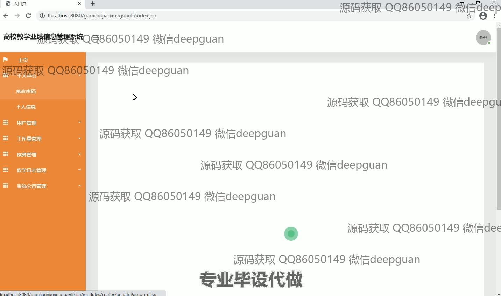
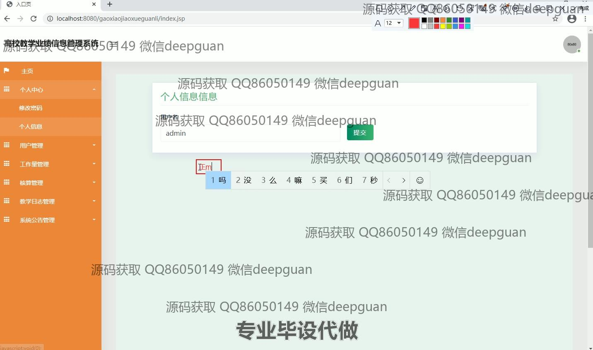
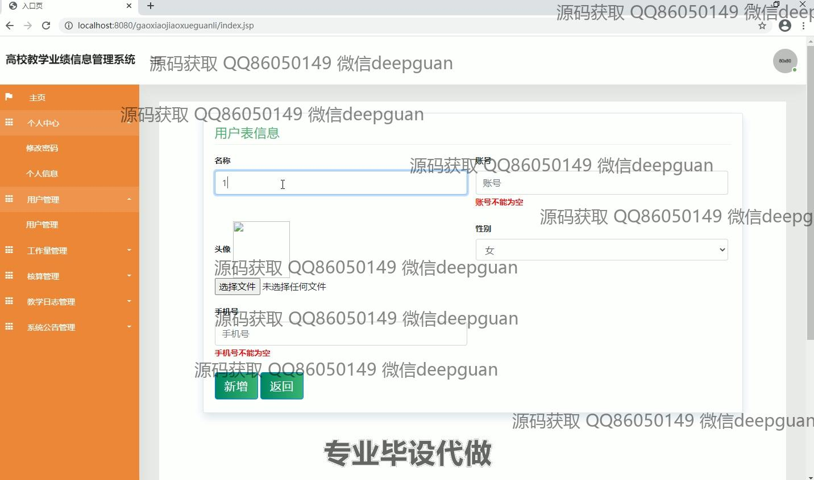
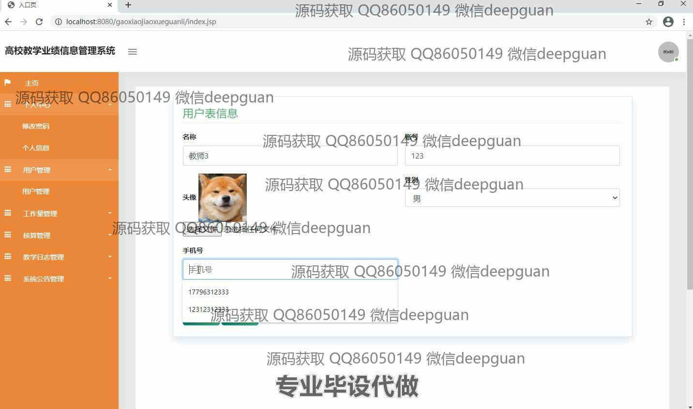
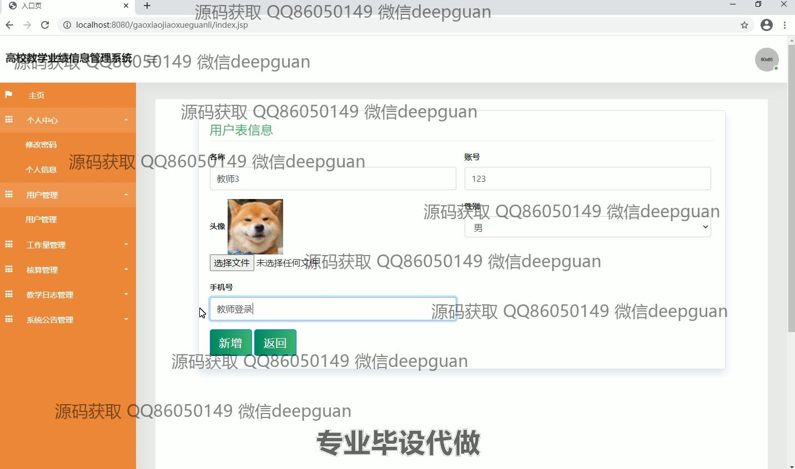
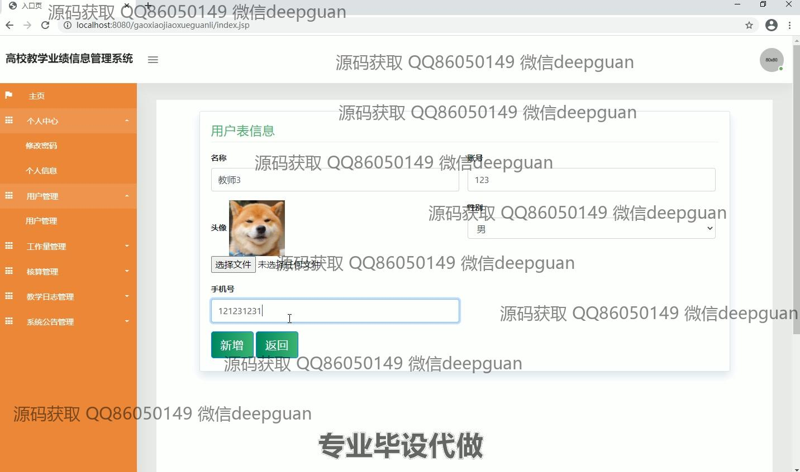
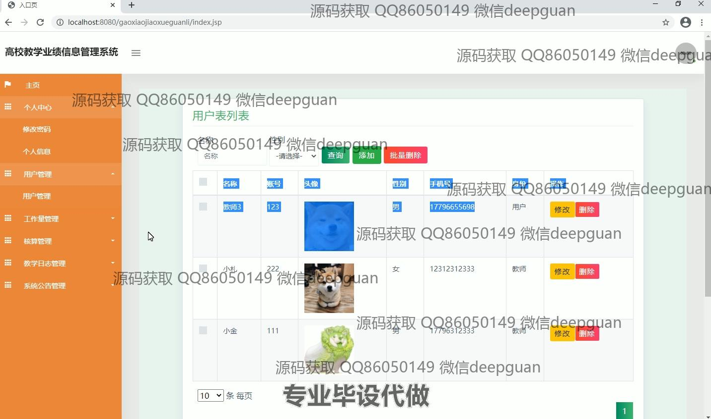
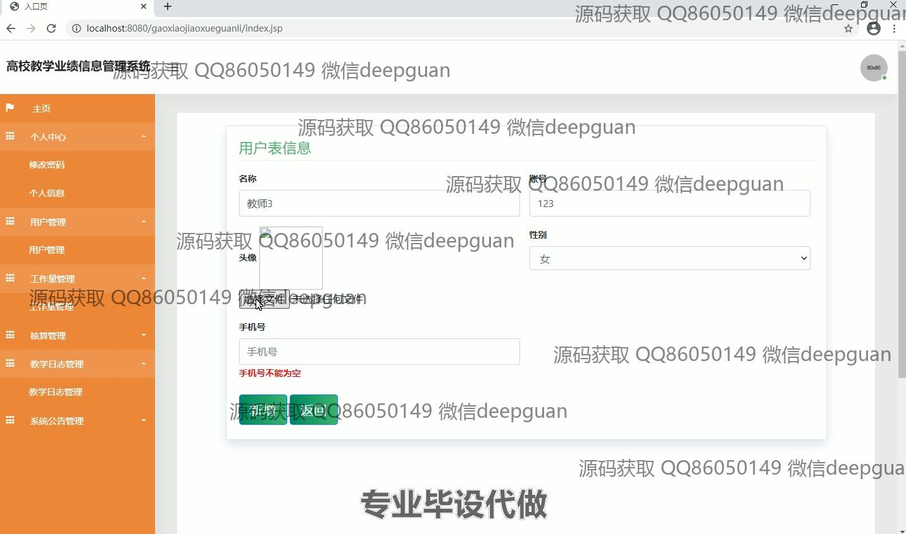
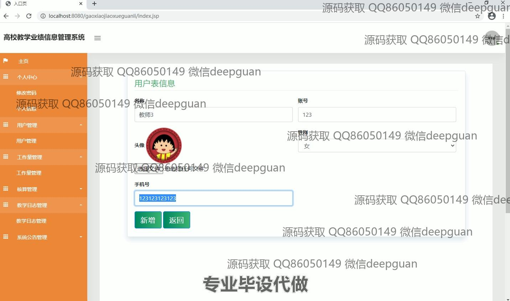
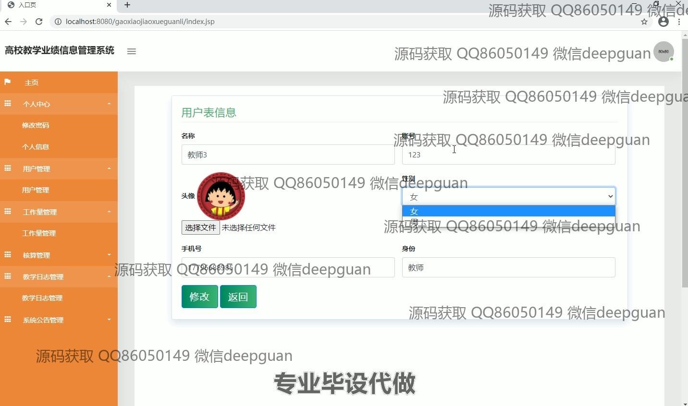
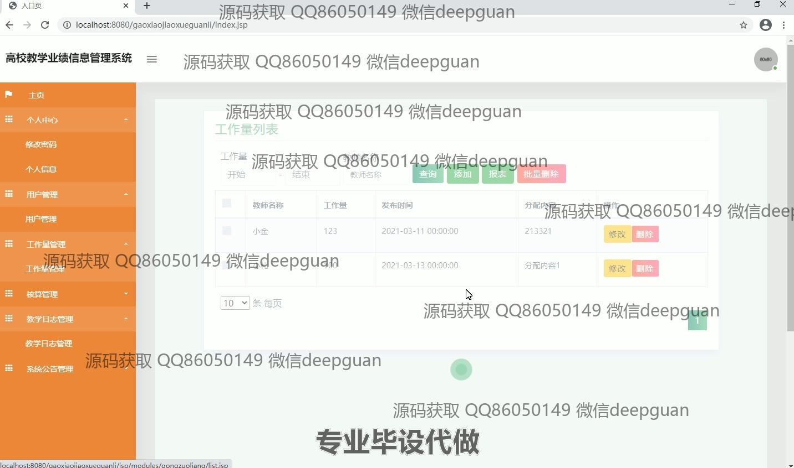
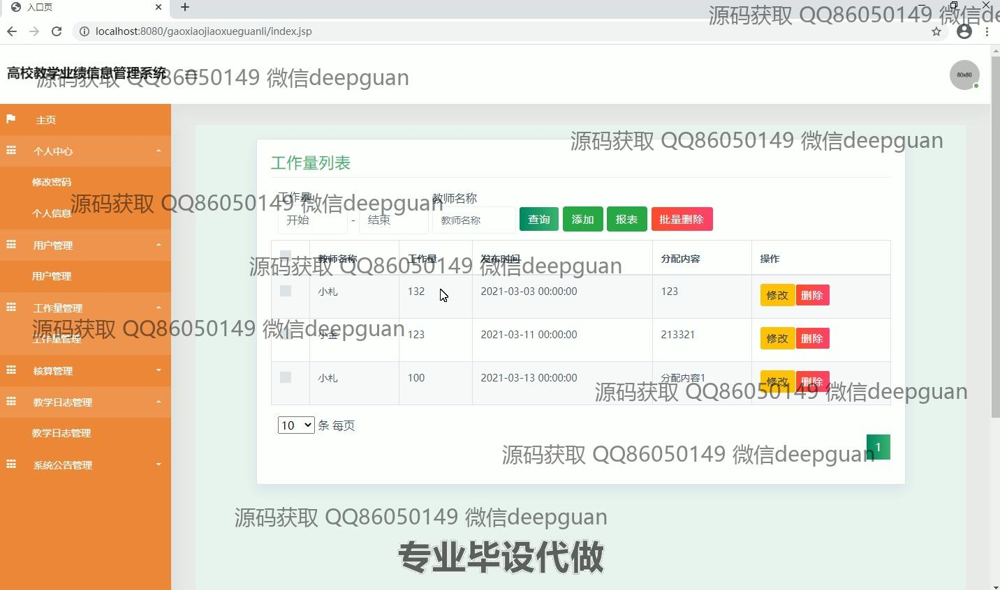
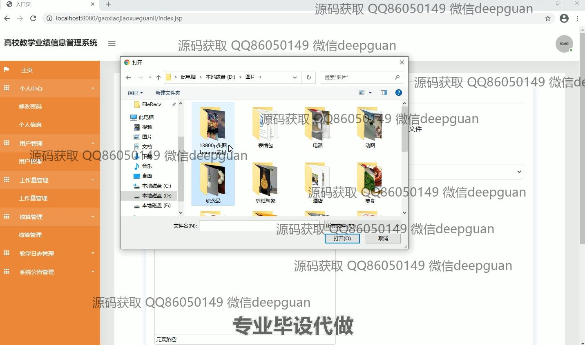
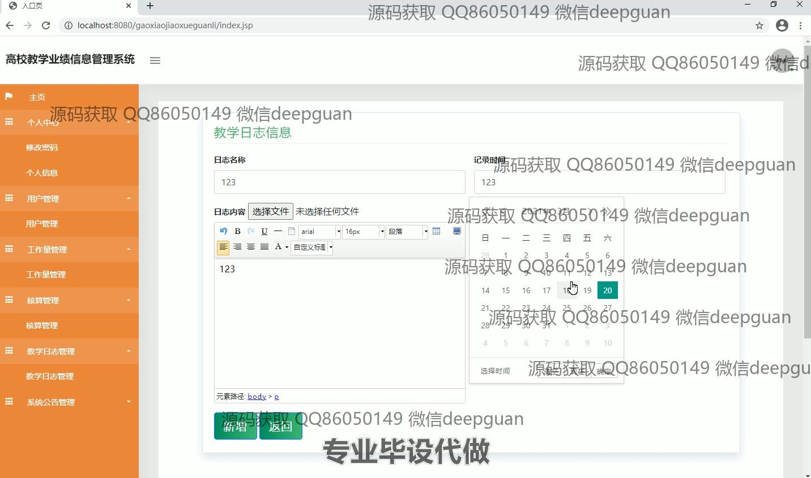
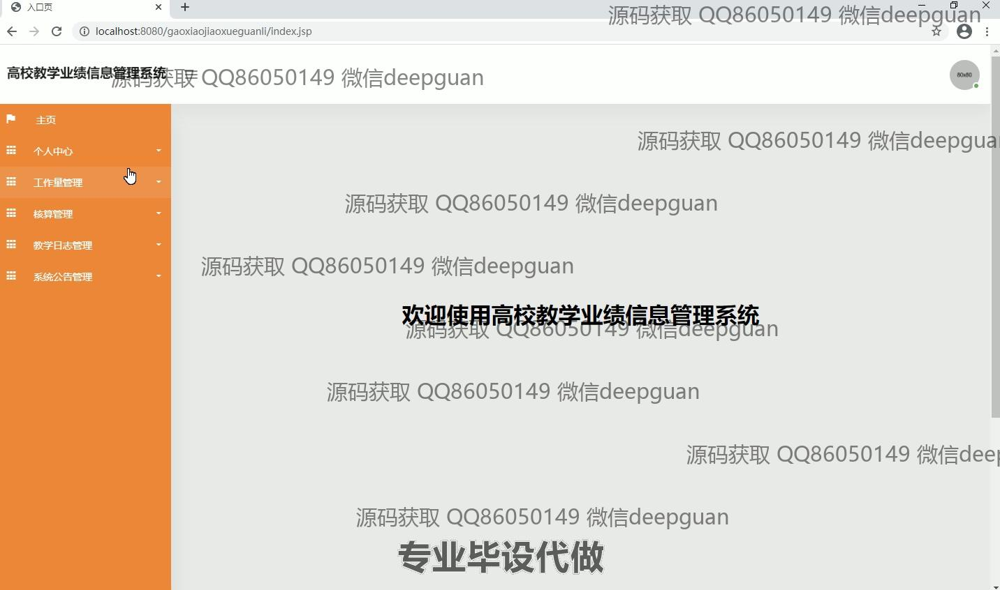
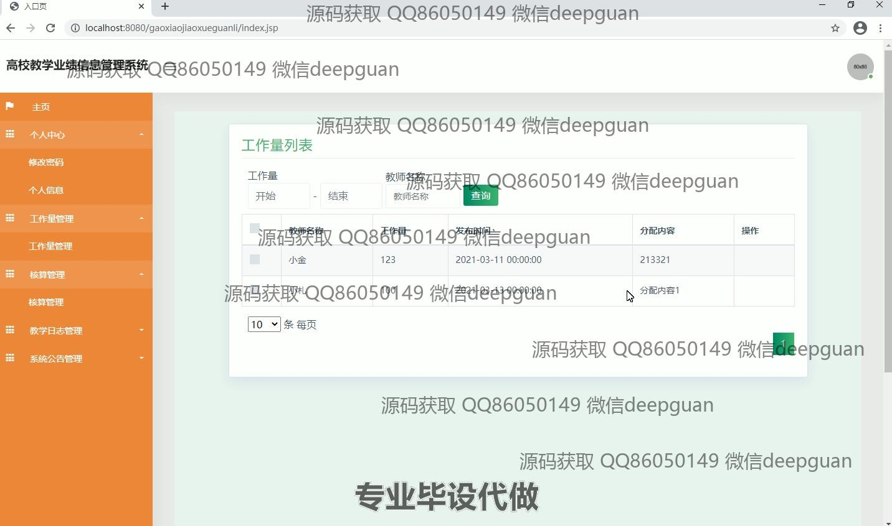
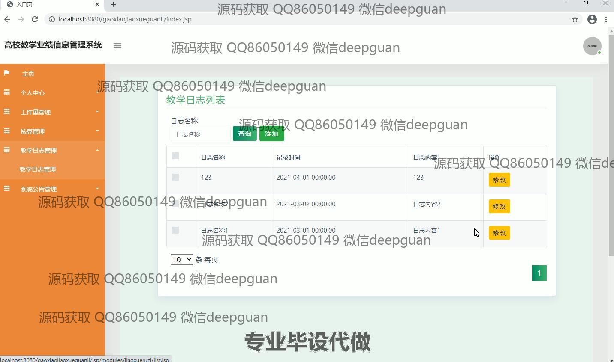

本代码来源于网络,仅供学习参考使用!

